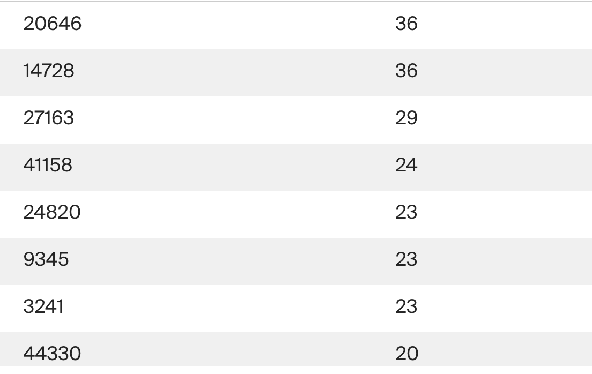

# Продвинутый SQL: Анализ данных StackOverflow

## Описание проекта

Данный проект состоит из двух частей: практических заданий в SQL-тренажёре для закрепления навыков и аналитической части, где необходимо самостоятельно анализировать полученные результаты и формулировать выводы. Проект использует базу данных StackOverflow, содержащую информацию о постах, пользователях, значках и типах постов за 2008 год с данными о более поздних оценках. 

### Цель проекта

*   Закрепить навыки работы с SQL с помощью практических задач.
*   Применить знания SQL для анализа реальных данных из базы StackOverflow.
*   Научиться интерпретировать результаты SQL-Заданиеов и формулировать выводы на основе данных.
*   Развить навыки анализа данных и формулирования гипотез на основе SQL-Заданиеов.

### Задачи проекта

1.  **Практические SQL-задания в тренажёре:**
    *   Решение набора SQL-задач для отработки пройденного материала.
    *   Применение SQL-Заданиеов к различным таблицам базы данных StackOverflow.
2. **Аналитическая часть:**
    * Самостоятельный анализ результатов SQL Заданиеов.
    *  Формулирование гипотез на основе данных.
    *  Формулирование выводов.
    * Изучение ER-диаграммы базы данных StackOverflow.
    * Изучение таблиц базы данных StackOverflow: `badges`, `post_types`, `posts` и `users`, `stackoverflow.votes`, `stackoverflow.vote_types`

**Описание таблиц:**

**Таблица `stackoverflow.badges`**

*   Хранит информацию о значках, которые присуждаются за разные достижения.
*   **Поля:**
    *   `id` (INTEGER, PRIMARY KEY): Идентификатор значка.
    *   `name` (VARCHAR): Название значка.
    *   `user_id` (INTEGER, FOREIGN KEY to users): Идентификатор пользователя, которому присвоили значок.
    *   `creation_date` (TIMESTAMP): Дата присвоения значка.

**Таблица `stackoverflow.post_types`**

*   Содержит информацию о типе постов.
*   **Поля:**
    *   `id` (INTEGER, PRIMARY KEY): Идентификатор типа поста.
    *   `type` (VARCHAR): Тип поста ("Question" или "Answer").

**Таблица `stackoverflow.posts`**

*   Содержит информацию о постах.
*   **Поля:**
    *   `id` (INTEGER, PRIMARY KEY): Идентификатор поста.
    *   `title` (VARCHAR): Заголовок поста.
    *   `creation_date` (TIMESTAMP): Дата создания поста.
    *   `favorites_count` (INTEGER): Количество добавлений поста в "Закладки".
    *   `last_activity_date` (TIMESTAMP): Дата последнего действия в посте.
    *   `last_edit_date` (TIMESTAMP): Дата последнего изменения поста.
    *   `user_id` (INTEGER, FOREIGN KEY to users): Идентификатор пользователя, создавшего пост.
    *   `parent_id` (INTEGER, FOREIGN KEY to posts): Идентификатор поста-родителя (для ответов).
    *   `post_type_id` (INTEGER, FOREIGN KEY to post_types): Идентификатор типа поста.
    *   `score` (INTEGER): Количество очков, набранных постом.
    *   `views_count` (INTEGER): Количество просмотров поста.

**Таблица `stackoverflow.users`**

*   Содержит информацию о пользователях.
*   **Поля:**
    *   `id` (INTEGER, PRIMARY KEY): Идентификатор пользователя.
    *   `creation_date` (TIMESTAMP): Дата регистрации пользователя.
    *   `display_name` (VARCHAR): Имя пользователя.
    *   `last_access_date` (TIMESTAMP): Дата последнего входа пользователя.
    *   `location` (VARCHAR): Местоположение пользователя.
    *   `reputation` (INTEGER): Очки репутации пользователя.
    *   `views` (INTEGER): Число просмотров профиля пользователя.
    
    В этом разделе описаны таблицы `stackoverflow.vote_types` и `stackoverflow.votes`, с которыми вы будете работать в рамках проекта.

**Таблица `stackoverflow.vote_types`**

*   Содержит информацию о типах голосов, которые пользователи ставят постам. Голоса используются для оценки полезности и уместности контента на платформе.

    **Типы голосов:**
    *   `UpMod` — Посты с вопросами или ответами, которые пользователи посчитали уместными и полезными.
    *   `DownMod` — Посты, которые показались пользователям наименее полезными.
    *   `Close` — Вопросы, которые нужно доработать или которые не подходят для платформы.
    *   `Offensive` — Ответы на вопросы в грубой и оскорбительной манере.
    *   `Spam` — Посты, выглядящие как откровенная реклама.

    **Поля:**

    | Поле             | Описание                                                       
   
    | `id`             | Идентификатор типа голоса, первичный ключ (INTEGER)            
    | `name`           | Название метки (VARCHAR)                                        

**Таблица `stackoverflow.votes`**

*   Содержит информацию о голосах, которые пользователи поставили постам.

    **Поля:**

    | Поле             | Описание                                                                      |
    | ---------------- | ----------------------------------------------------------------------------- |
    | `id`             | Идентификатор голоса, первичный ключ (INTEGER)                               |
    | `post_id`        | Идентификатор поста, внешний ключ к таблице `posts` (INTEGER, FOREIGN KEY)    |
    | `user_id`        | Идентификатор пользователя, который поставил голос, внешний ключ к `users` (INTEGER, FOREIGN KEY) |
    | `bounty_amount`  | Сумма вознаграждения, назначенного для привлечения внимания к посту (INTEGER)|
    | `vote_type_id`   | Идентификатор типа голоса, внешний ключ к таблице `vote_types` (INTEGER, FOREIGN KEY) |
    | `creation_date`  | Дата назначения голоса (TIMESTAMP)                                           |

### Этапы проекта

1.  **Изучение базы данных:**
    *   Ознакомление с ER-диаграммой базы данных StackOverflow.
    *   Изучение структуры и содержимого таблиц: `badges`, `post_types`, `posts` и `users`.
2.  **Выполнение SQL-заданий:**
    *   Выполнение заданий в SQL-тренажёре для закрепления навыков работы с SQL.
3.  **Анализ данных:**
    *   Анализ результатов SQL-Заданиеов, полученных при решении задач.
    *   Формулирование гипотез на основе данных.
    *   Формулирование выводов и обобщений.
  
## Используемые инструменты

*   **SQL:** для Заданиеов к базе данных.
*   **SQL-тренажёр:** для выполнения практических заданий.
*   **Jupyter Notebook (опционально):** для документирования процесса анализа и результатов.

## Практическая часть

### Задание №1

Найдите количество вопросов, которые набрали больше 300 очков или как минимум 100 раз были добавлены в «Закладки».

<table>
<thead>
<tr><td>Code</tr>
</thead>
<tbody>
<tr>
<td>

```sql
SELECT count (p.id)
FROM stackoverflow.posts p
JOIN stackoverflow.post_types as po ON po.id=p.post_type_id
WHERE po.type = 'Question' AND ( score >300 OR favorites_count >= 100)
```
</tr>
<tr>
<td>Результа</tr>
<tr>
<td>


</tr>
</tbody>
</table>

### Задание №2

Сколько в среднем в день задавали вопросов с 1 по 18 ноября 2008 включительно? Результат округлите до целого числа.

<table>
<thead>
<tr><td>Code</tr>
</thead>
<tbody>
<tr>
<td>

```sql
WITH v as (SELECT count (p.id) as c
FROM stackoverflow.posts p
JOIN stackoverflow.post_types as po ON po.id=p.post_type_id
WHERE po.type = 'Question' AND   DATE_TRUNC('day', creation_date) BETWEEN '2008-11-01' AND '2008-11-18'
GROUP by DATE_TRUNC('day', creation_date))

SELECT ROUND (AVG (c),0)
FROM v 
```
</tr>
<tr>
<td>Результат</tr>
<tr>
<td>


</tr>
</tbody>
</table>

### Задание №3

Сколько пользователей получили значки сразу в день регистрации? Выведите количество уникальных пользователей.

<table>
<thead>
<tr><td>Code</tr>
</thead>
<tbody>
<tr>
<td>

```sql
SELECT COUNT (DISTINCT(s.user_id))
FROM stackoverflow.badges as s
LEFT JOIN stackoverflow.users as u ON u.id=s.user_id
WHERE DATE(s.creation_date) = DATE(u.creation_date) 
```
</tr>
<tr>
<td>Результат</tr>
<tr>
<td>


</tr>
</tbody>
</table>

### Задание №4

Сколько уникальных постов пользователя с именем Joel Coehoorn получили хотя бы один голос?

<table>
<thead>
<tr><td>Code</tr>
</thead>
<tbody>
<tr>
<td>

```sql
SELECT COUNT(DISTINCT(p.id)) as post
FROM stackoverflow.posts as p
JOIN stackoverflow.users as u ON u.id=p.user_id
JOIN stackoverflow.votes as v ON v.post_id=p.id
WHERE u.display_name ='Joel Coehoorn'
```
</tr>
<tr>
<td>Результат</tr>
<tr>
<td>


</tr>
</tbody>
</table>

### Задание №5

Выгрузите все поля таблицы `vote_types`. Добавьте к таблице поле `rank`, в которое войдут номера записей в обратном порядке. Таблица должна быть отсортирована по полю `id`.

<table>
<thead>
<tr><td>Code</tr>
</thead>
<tbody>
<tr>
<td>

```sql
SELECT *, ROW_NUMBER() OVER (ORDER BY id desc) AS RANK
FROM stackoverflow.vote_types
ORDER BY id 
```
</tr>
<tr>
<td>Результат</tr>
<tr>
<td>


</tr>
</tbody>
</table>

### Задание №6

Отберите 10 пользователей, которые поставили больше всего голосов типа Close. Отобразите таблицу из двух полей: идентификатором пользователя и количеством голосов. Отсортируйте данные сначала по убыванию количества голосов, потом по убыванию значения идентификатора пользователя.
<table>
<thead>
<tr><td>Code</tr>
</thead>
<tbody>
<tr>
<td>

```sql
SELECT u.id, COUNT(v.id) as count1

FROM stackoverflow.users as u
INNER JOIN stackoverflow.votes as v ON u.id = v.user_id
INNER JOIN stackoverflow.vote_types as vt ON vt.id=v.vote_type_id
WHERE vt.name='Close'
GROUP By u.id
ORDER BY count1 desc, u.id desc
LIMIT 10
```
</tr>
<tr>
<td>Результат</tr>
<tr>
<td>


</tr>
</tbody>
</table>

### Задание №7

Отберите 10 пользователей по количеству значков, полученных в период с 15 ноября по 15 декабря 2008 года включительно.
Отобразите несколько полей:
идентификатор пользователя;
число значков;
место в рейтинге — чем больше значков, тем выше рейтинг.
Пользователям, которые набрали одинаковое количество значков, присвойте одно и то же место в рейтинге.
Отсортируйте записи по количеству значков по убыванию, а затем по возрастанию значения идентификатора пользователя.

<table>
<thead>
<tr><td>Code</tr>
</thead>
<tbody>
<tr>
<td>

```sql
WITH a as (SELECT user_id, COUNT (id) as count1
FROM stackoverflow.badges
WHERE DATE_TRUNC('day', creation_date) BETWEEN '2008-11-15' AND '2008-12-15' 
GROUP By user_id
)

SELECT *, DENSE_RANK() OVER (ORDER BY count1 DESC) AS rank
FROM a
ORDER BY count1 DESC, user_id ASC
LIMIT 10
```
</tr>
<tr>
<td>Результат</tr>
<tr>
<td>


</tr>
</tbody>
</table>

### Задание №8

Сколько в среднем очков получает пост каждого пользователя?
Сформируйте таблицу из следующих полей:
заголовок поста;
идентификатор пользователя;
число очков поста;
среднее число очков пользователя за пост, округлённое до целого числа.
Не учитывайте посты без заголовка, а также те, что набрали ноль очков.

<table>
<thead>
<tr><td>Code</tr>
</thead>
<tbody>
<tr>
<td>

```sql
SELECT title, user_id, score, ROUND(AVG(score) OVER(PARTITION BY user_id),0)
FROM stackoverflow.posts
WHERE title IS NOT NULL AND score != 0
```
</tr>
<tr>
<td>Результат</tr>
<tr>
<td>


</tr>
</tbody>
</table>

### Задание №9

Отобразите заголовки постов, которые были написаны пользователями, получившими более 1000 значков. Посты без заголовков не должны попасть в список.

<table>
<thead>
<tr><td>Code</tr>
</thead>
<tbody>
<tr>
<td>

```sql
WITH
users AS (SELECT user_id,
    COUNT(creation_date) count_badges
FROM stackoverflow.badges  b
GROUP BY user_id
HAVING COUNT(creation_date) > 1000)

SELECT title
FROM stackoverflow.posts p
WHERE user_id = (SELECT user_id FROM users) AND title IS NOT NULL;
```
</tr>
<tr>
<td>Результат</tr>
<tr>
<td>


</tr>
</tbody>
</table>

### Задание №10

Напишите Задание, который выгрузит данные о пользователях из Канады (англ. Canada). Разделите пользователей на три группы в зависимости от количества просмотров их профилей:
пользователям с числом просмотров больше либо равным 350 присвойте группу 1;
пользователям с числом просмотров меньше 350, но больше либо равно 100 — группу 2;
пользователям с числом просмотров меньше 100 — группу 3.
Отобразите в итоговой таблице идентификатор пользователя, количество просмотров профиля и группу. Пользователи с количеством просмотров меньше либо равным нулю не должны войти в итоговую таблицу.
<table>
<thead>
<tr><td>Code</tr>
</thead>
<tbody>
<tr>
<td>

```sql
SELECT id, views,
CASE
    WHEN views >= 350 THEN 1
    WHEN views >= 100 AND views < 350 THEN 2
    WHEN views < 100 THEN 3
END
FROM stackoverflow.users
WHERE location LIKE '%Canada%' AND views>0
```
</tr>
<tr>
<td>Результат</tr>
<tr>
<td>


</tr>
</tbody>
</table>

### Задание №11

Дополните предыдущий Задание. Отобразите лидеров каждой группы — пользователей, которые набрали максимальное число просмотров в своей группе. Выведите поля с идентификатором пользователя, группой и количеством просмотров. Отсортируйте таблицу по убыванию просмотров, а затем по возрастанию значения идентификатора.

<table>
<thead>
<tr><td>Code</tr>
</thead>
<tbody>
<tr>
<td>

```sql
WITH a as (SELECT id, views,
CASE
    WHEN views < 100 THEN 3 
        WHEN views >= 100 AND views < 350 THEN 2
        ELSE 1
END as b
FROM stackoverflow.users
WHERE location LIKE '%Canada%' AND views>0)

SELECT id, b, max1
FROM (SELECT id, b, views,
MAX(views) OVER (PARTITION BY b ORDER BY views DESC) as max1
FROM a) as x
WHERE max1=views
ORDER BY views DESC, id
```
</tr>
<tr>
<td>Результат</tr>
<tr>
<td>


</tr>
</tbody>
</table>

### Задание №12

Посчитайте ежедневный прирост новых пользователей в ноябре 2008 года. Сформируйте таблицу с полями:
номер дня;
число пользователей, зарегистрированных в этот день;
сумму пользователей с накоплением.

<table>
<thead>
<tr><td>Code</tr>
</thead>
<tbody>
<tr>
<td>

```sql
WITH a as (SELECT extract(day from creation_date :: date)  as day,
COUNT (id) as p
FROM stackoverflow.users
WHERE date_trunc('day', creation_date) between '2008-11-01' and '2008-11-30' 
GROUP BY extract(day from creation_date :: date)) 

SELECT SUM (p) OVER (order by a.day), a.day, a.p
FROM a
```
</tr>
<tr>
<td>Результат</tr>
<tr>
<td>


</tr>
</tbody>
</table>

### Задание №13

Для каждого пользователя, который написал хотя бы один пост, найдите интервал между регистрацией и временем создания первого поста. Отобразите:
идентификатор пользователя;
разницу во времени между регистрацией и первым постом.

<table>
<thead>
<tr><td>Code</tr>
</thead>
<tbody>
<tr>
<td>

```sql
WITH a as (
    
SELECT u.id, MIN (p.creation_date) as min1, u.creation_date as start1

--LAG(users_cnt, 7) OVER (ORDER BY session_date) AS p
FROM stackoverflow.users as u
JOIN stackoverflow.posts as p ON p.user_id=u.id
GROUP BY u.id,start1  )

SELECT id, (min1 - start1) as q
FROM a
```
</tr>
<tr>
<td>Результат</tr>
<tr>
<td>


</tr>
</tbody>
</table>

## Задания аналитические (Вторая часть)

### Задание №1

Выведите общую сумму просмотров у постов, опубликованных в каждый месяц 2008 года. Если данных за какой-либо месяц в базе нет, такой месяц можно пропустить. Результат отсортируйте по убыванию общего количества просмотров.
<table>
<thead>
<tr><td>Code</tr>
</thead>
<tbody>
<tr>
<td>

```sql
WITH a as (SELECT DATE_TRUNC('month', creation_date) ::date AS month1, views_count 
FROM stackoverflow.posts
WHERE EXTRACT (year from creation_date) = 2008)
SELECT month1, SUM(views_count) as mi
FROM a
GROUP BY month1
ORDER BY mi DESC
```
</tr>
<tr>
<td>Результат</tr>
<tr>
<td>


</tr>
</tbody>
</table>

### Задание №2


Выведите имена самых активных пользователей, которые в первый месяц после регистрации (включая день регистрации) дали больше 100 ответов. Вопросы, которые задавали пользователи, не учитывайте. Для каждого имени пользователя выведите количество уникальных значений user_id. Отсортируйте результат по полю с именами в лексикографическом порядке.
<table>
<thead>
<tr><td>Code</tr>
</thead>
<tbody>
<tr>
<td>

```sql
SELECT COUNT(DISTINCT(p.user_id)) as user_id, u.display_name
FROM stackoverflow.users as u
JOIN stackoverflow.posts as p ON p.user_id=u.id
JOIN stackoverflow.post_types as t ON t.id=p.post_type_id
WHERE t.type='Answer' AND (DATE_TRUNC('day', p.creation_date)) <= (u.creation_date + INTERVAL '1 month') 
GROUP By u.display_name
HAVING COUNT (p.user_id)>100 
ORDER BY u.display_name
```
</tr>
<tr>
<td>Результат</tr>
<tr>
<td>


</tr>
</tbody>
</table>

### Задание №3

Выведите количество постов за 2008 год по месяцам. Отберите посты от пользователей, которые зарегистрировались в сентябре 2008 года и сделали хотя бы один пост в декабре того же года. Отсортируйте таблицу по значению месяца по убыванию.

<table>
<thead>
<tr><td>Code</tr>
</thead>
<tbody>
<tr>
<td>

```sql
with a as (SELECT u.id
FROM stackoverflow.posts as p
JOIN stackoverflow.users as u ON u.id=p.user_id
WHERE DATE_TRUNC('month', u.creation_date)::date = '2008-09-01' 
                   AND DATE_TRUNC('month', p.creation_date)::date = '2008-12-01'
GROUP BY u.id
HAVING COUNT(p.id) > 0)

SELECT COUNT(p.id), DATe_trunc ('month', p.creation_date)::date
FROM stackoverflow.posts as p
WHERE p.user_id IN (SELECT *
               FROM a) AND DATE_TRUNC('year', p.creation_date)::date = '2008-01-01'
GROUP by DATe_trunc ('month', p.creation_date)::date
ORDER BY DATe_trunc ('month', p.creation_date)::date DESC
```
</tr>
<tr>
<td>Результат</tr>
<tr>
<td>


</tr>
</tbody>
</table>

### Задание №4

4.
Используя данные о постах, выведите несколько полей:
идентификатор пользователя, который написал пост;
дата создания поста;
количество просмотров у текущего поста;
сумма просмотров постов автора с накоплением.
Данные в таблице должны быть отсортированы по возрастанию идентификаторов пользователей, а данные об одном и том же пользователе — по возрастанию даты создания поста.
<table>
<thead>
<tr><td>Code</tr>
</thead>
<tbody>
<tr>
<td>

```sql
SELECT user_id, creation_date, views_count, SUM (views_count) OVER (PARTITION BY user_id ORDER BY creation_date)
FROM stackoverflow.posts
ORDER BY user_id
```
</tr>
<tr>
<td>Результат</tr>
<tr>
<td>


</tr>
</tbody>
</table>

### Задание №5

Сколько в среднем дней в период с 1 по 7 декабря 2008 года включительно пользователи взаимодействовали с платформой? Для каждого пользователя отберите дни, в которые он или она опубликовали хотя бы один пост. Нужно получить одно целое число — не забудьте округлить результат.
<table>
<thead>
<tr><td>Code</tr>
</thead>
<tbody>
<tr>
<td>

```sql
WITH a as (SELECT user_id, COUNT(DISTINCT creation_date::date) as co
FROM stackoverflow.posts 

WHERE creation_date::date Between '2008-12-01' AND '2008-12-07'
GROUP BY user_id)

SELECT ROUND (AVG(co),0)
from a
```
</tr>
<tr>
<td>Результат</tr>
<tr>
<td>


</tr>
</tbody>
</table>

### Задание №6

На сколько процентов менялось количество постов ежемесячно с 1 сентября по 31 декабря 2008 года? Отобразите таблицу со следующими полями:
Номер месяца.
Количество постов за месяц.
Процент, который показывает, насколько изменилось количество постов в текущем месяце по сравнению с предыдущим.
Если постов стало меньше, значение процента должно быть отрицательным, если больше — положительным. Округлите значение процента до двух знаков после запятой.
Напомним, что при делении одного целого числа на другое в PostgreSQL в результате получится целое число, округлённое до ближайшего целого вниз. Чтобы этого избежать, переведите делимое в тип numeric.
<table>
<thead>
<tr><td>Code</tr>
</thead>
<tbody>
<tr>
<td>

```sql
WITH a as (SELECT COUNT(DISTINCT id), EXTRACT (month from creation_date) as mon
FROM stackoverflow.posts
WHERE creation_date::date Between '2008-09-01' AND '2008-12-31'
GROUP BY mon )

SELECT mon, count,
 ROUND(((count::numeric / LAG(count) OVER (ORDER BY mon)) - 1) * 100, 2) AS user_growth
FROM a
```
</tr>
<tr>
<td>Результат</tr>
<tr>
<td>


</tr>
</tbody>
</table>

### Задание №7


Найдите пользователя, который опубликовал больше всего постов за всё время с момента регистрации. Выведите данные его активности за октябрь 2008 года в таком виде:
номер недели;
дата и время последнего поста, опубликованного на этой неделе.

<table>
<thead>
<tr><td>Code</tr>
</thead>
<tbody>
<tr>
<td>

```sql
WITH perv as (SELECT p.user_id, COUNT (DISTINCT (p.id)) as co
FRom stackoverflow.posts as p
GROUP By user_id
ORDER BY co DESC 
LIMIT 1),

two as (SELECT EXTRACT (week from post.creation_date) as weekn, post.creation_date
FROm perv as pe
LEFT JOIN stackoverflow.posts as post ON pe.user_id=post.user_id
WHERE DATE_TRUNC('month', post.creation_date)::date = '2008-10-01')

SELECT DISTINCT (weekn::numeric),
MAX(creation_date) OVER (PARTITION BY weekn)
FROM two
```
</tr>
<tr>
<td>Результат</tr>
<tr>
<td>


</tr>
</tbody>
</table>
